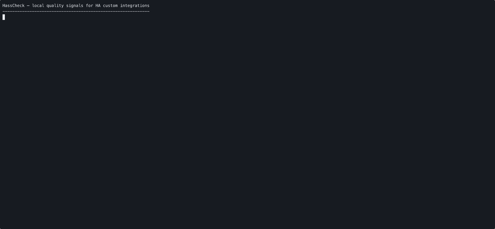

# HassCheck

[](https://github.com/Daily-Nerd/hasscheck/actions/workflows/ci.yml)

HassCheck is an **unofficial** CLI for Home Assistant community integration maintainers.

It checks custom integration repositories for sourced HA/HACS quality signals and produces explainable, actionable reports.

```text
Security Review: Not performed
Official HA Tier: Not assigned
HACS Acceptance: Not guaranteed
```

HassCheck is not affiliated with Home Assistant, HACS, Nabu Casa, or the Open Home Foundation. It does **not** certify integrations, prove that an integration is safe, or guarantee HACS acceptance.

## What HassCheck does

HassCheck turns scattered Home Assistant and HACS expectations into local checks that are:

- **Sourced** — every finding carries a source URL and checked date.
- **Explainable** — each rule has a stable ID, version, title, reason, and fix suggestion.
- **Actionable** — output points maintainers toward concrete next fixes.
- **Machine-readable** — JSON output is the stable contract for future GitHub Actions, badges, hosted reports, and tooling.

HassCheck starts as a local CLI. Public badges, hosted reports, and any future hub should be opt-in only.

## Quick Start

```bash
pip install hasscheck
hasscheck --version
hasscheck check --path /path/to/your/integration
```

HassCheck runs **locally** — it does not publish anything unless you explicitly opt in with `hasscheck publish` or `emit-publish: 'true'` in CI.

To understand a specific finding:

```bash
hasscheck explain manifest.domain.exists
```

## See it in action

HassCheck is designed to produce concrete next steps, not a vague score.

<!-- The GIF below is rendered from `docs/demo.sh`. See `docs/recording.md` to regenerate. -->


```bash
uv run hasscheck check --path examples/bad_integration
uv run hasscheck scaffold diagnostics --path examples/bad_integration --dry-run
```

See [`docs/demo.md`](docs/demo.md) for the full walkthrough or
[`docs/recording.md`](docs/recording.md) to regenerate the visual demo.

## How HassCheck relates to other tools

| Tool | Purpose | HassCheck relationship |
|---|---|---|
| [hassfest](https://github.com/home-assistant/core/tree/dev/script/hassfest) | Validates Home Assistant integration metadata and compatibility expectations. | Complementary. HassCheck does not replace hassfest. |
| [HACS publishing docs](https://www.hacs.xyz/docs/publish/start/) | Define repository structure and metadata expectations for HACS custom integrations. | HassCheck turns selected expectations into sourced local checks. |
| [Home Assistant Integration Quality Scale](https://developers.home-assistant.io/docs/core/integration-quality-scale/) | Official framework for graded core integrations. | HassCheck reports unofficial quality signals only; it does not assign official tiers. |

HassCheck is intentionally not a replacement for hassfest and does not assign Home Assistant quality tiers. It provides maintainer-facing, sourced findings that help custom integration authors improve their repositories.

## Current status

**Current package version**: v0.13.0 — beta.

The CLI, GitHub Action, JSON report contract, rule docs, local badge generation, opt-in publishing flow, per-rule settings, report provenance block, and publish `--dry-run` are all shipped. 52 rules across HACS structure, manifest metadata, modern HA patterns, diagnostics, docs, tests/CI, and maintenance. Auto-generated per-rule docs page for every registered rule. Published to PyPI.

The hub at [hasscheck.io](https://hasscheck.io) is operational and accepts opt-in published reports via GitHub OIDC.

**Current development focus**:

- hasscheck-web: accept `schema_version` `0.4.0`, set `provenance.verified_by` at OIDC ingest
- Upgrade Radar card on hub (v1.0 — uses ADR 0011 taxonomy)
- Hub-verified badge endpoint (replaces self-reported committed badge JSON)

## GitHub Action

Add HassCheck to any integration repository's CI with one step:

```yaml
name: HassCheck

on:
  pull_request:
  push:
    branches: [main]

jobs:
  hasscheck:
    runs-on: ubuntu-latest
    steps:
      - uses: actions/checkout@v4
      - uses: Daily-Nerd/hasscheck@v0.13.0
        with:
          comment-pr: true
          github-token: ${{ secrets.GITHUB_TOKEN }}
```

**Inputs:**

| Input | Default | Description |
|---|---|---|
| `path` | `.` | Repository path to inspect |
| `no-config` | `false` | Ignore `hasscheck.yaml` if present |
| `comment-pr` | `false` | Post findings as a PR comment |
| `github-token` | `''` | Required when `comment-pr: true` |
| `emit-badges` | `false` | Generate shields.io badge JSON and upload as artifact |
| `badges-out-dir` | `badges` | Directory for badge JSON when `emit-badges: 'true'` |
| `emit-publish` | `false` | Publish the report to a hosted HassCheck service. Requires workflow `permissions: id-token: write` |
| `publish-endpoint` | `https://hasscheck.io` | Publish endpoint URL when `emit-publish: 'true'` |

> The hosted reports endpoint at `hasscheck.io` is operational. Publishing requires `permissions: id-token: write` on the workflow so HassCheck can mint a GitHub OIDC token; the hub validates the token's repository claim before accepting the report. The local CLI (without `emit-publish`) remains fully functional and is the recommended starting point if you don't want to publish.

Before enabling `emit-publish` in your CI workflow, validate the publish path locally with `--dry-run`:

```bash
hasscheck publish --path . --dry-run
# would publish report to: https://hasscheck.io
#   - repo slug: owner/my-integration (from git remote)
#   - schema_version: 0.4.0
#   - ruleset: hasscheck-ha-2026.5
#   - 52 rules evaluated, 3 findings
#   - oidc token: not detected
#   - endpoint resolved from: default
#   - dry-run: no network request made
```

`--dry-run` runs the full check, resolves the endpoint and detects OIDC token availability — without making any network request. Use it to confirm your configuration before the first live publish.

**Outputs:** `exit-code` — `0` when no FAIL findings, `1` when one or more FAIL findings.

The action uploads `hasscheck-report.json` as a build artifact on every run.

## Badges (opt-in)

HassCheck can generate [shields.io](https://shields.io) endpoint JSON files for embedding specific quality signals in your README. Badges are **opt-in only** and show specific signals — not vague trust claims.

### Generate locally

```bash
hasscheck badge --path . --out-dir badges/
```

This writes per-category JSON files and a `manifest.json` to `badges/`. Commit these files to your repo.

### Generate in CI

Add `emit-badges: 'true'` to your HassCheck action step:

```yaml
- uses: Daily-Nerd/hasscheck@v0.13.0
  with:
    emit-badges: 'true'
    badges-out-dir: 'badges'
```

This uploads a `hasscheck-badges` artifact. To embed in your README, publish the JSON files somewhere publicly accessible (e.g. committed to your repo or hosted on GitHub Pages).

### Embed in README

Replace `OWNER/REPO/main` with your repository path:

```markdown


```

Badges show the current state of your integration: `Passing`, `Partial`, or `Issues`. For `Config Flow` and `Diagnostics`, suffixes are `Present` or `Missing`.

> HassCheck is unofficial and not affiliated with Home Assistant, HACS, or Nabu Casa.
> Security Review: Not performed. HACS Acceptance: Not guaranteed.

## Install

```bash
pip install hasscheck
```

Or with [`uv`](https://docs.astral.sh/uv/):

```bash
uv tool install hasscheck
```

Requires Python ≥ 3.12.

## Install for local development

This repository uses [`uv`](https://docs.astral.sh/uv/) for dependency management.

```bash
uv sync
```

Run the CLI without installing globally:

```bash
.venv/bin/python -m hasscheck --help
```

## Commands

### Check a repository

```bash
.venv/bin/python -m hasscheck check --path .
```

### Emit JSON

```bash
.venv/bin/python -m hasscheck check --path . --format json
```

### Print the JSON schema

```bash
.venv/bin/python -m hasscheck schema
```

### Skip config file

```bash
.venv/bin/python -m hasscheck check --path . --no-config
```

### Explain a rule

```bash
.venv/bin/python -m hasscheck explain manifest.domain.exists
```

### Scaffold a GitHub Actions workflow

```bash
.venv/bin/python -m hasscheck scaffold github-action --path .
```

### Scaffold a diagnostics.py starter

```bash
.venv/bin/python -m hasscheck scaffold diagnostics --path .
```

### Scaffold a repairs.py starter

```bash
.venv/bin/python -m hasscheck scaffold repairs --path .
```

Use `--dry-run` to preview without writing, `--force` to overwrite an existing file.

## Configuration

HassCheck reads `hasscheck.yaml` at the repository root when present.

The file supports two separate kinds of user intent:

1. **Project applicability context** — declare project-level facts once, so selected rules can return `not_applicable` without repetitive per-rule overrides.
2. **Per-rule overrides** — mark specific RECOMMENDED rules as `not_applicable` or `manual_review` with a written reason.

```yaml
# hasscheck.yaml
schema_version: "0.4.0"

applicability:
  supports_diagnostics: false
  has_user_fixable_repairs: false
  uses_config_flow: false

rules:
  repo.license.exists:
    status: manual_review
    reason: License decision pending before public release.
```

**Rules for project applicability:**

- Flags only explain intentionally missing optional signals.
- Natural `pass` findings still win — existing files are not hidden by stale config.
- Correctness failures stay locked. For example, `uses_config_flow: false` does not hide a `config_flow.py` / `manifest.json` mismatch.
- Applied decisions are disclosed in JSON as `summary.applicability_applied` and marked in terminal findings with `(config)`.

**Rules for overrides:**

- `status` must be `not_applicable` or `manual_review` — you cannot force a finding to `pass`.
- `reason` is required — it is the audit trail.
- REQUIRED rules (e.g. `manifest.exists`) cannot be overridden.
- Run `hasscheck explain <rule-id>` to check if a rule is overridable.
- Use `--no-config` to ignore `hasscheck.yaml` (useful for CI debugging).

See `hasscheck.example.yaml` in this repository for a full annotated example.
See `docs/architecture/config-file.md` and `docs/architecture/project-applicability-context.md` for the design rationale.

## Finding statuses

HassCheck findings use explicit statuses instead of a single global certification score.

| Status | Meaning |
| --- | --- |
| `pass` | The signal was found. |
| `warn` | The signal is missing or incomplete, but should not block every project. |
| `fail` | The repository has an internally inconsistent or required metadata problem. |
| `not_applicable` | The rule does not apply yet or cannot be evaluated from current context. |
| `manual_review` | Human judgment is needed. |

## Example terminal output

```text
HassCheck Summary

Diagnostics/Repairs: 2 / 2
Docs/Support: 1 / 1
HACS Structure: 3 / 3
Maintenance Signals: 1 / 1
Manifest Metadata: 7 / 7
Modern HA Patterns: 2 / 2
Tests/CI: 2 / 2

Overall: Informational only
Security Review: Not performed
Official HA Tier: Not assigned
HACS Acceptance: Not guaranteed
```

The exact category order may change as rules evolve. The JSON schema is the durable contract.

## Documentation

Per-rule documentation pages with status behavior tables, fix instructions, and examples: [`docs/rules/`](docs/rules/README.md).

## Current rule set

### HACS structure

| Rule ID | Signal |
| --- | --- |
| `hacs.custom_components.exists` | Repository has `custom_components/`. |
| `hacs.file.parseable` | Repository has parseable `hacs.json`. |
| `brand.icon.exists` | Integration has `custom_components/<domain>/brand/icon.png`. |

### Manifest metadata

| Rule ID | Signal |
| --- | --- |
| `manifest.exists` | Integration has `manifest.json`. |
| `manifest.domain.exists` | Manifest defines `domain`. |
| `manifest.domain.matches_directory` | Manifest `domain` matches the integration directory name. |
| `manifest.name.exists` | Manifest defines `name`. |
| `manifest.version.exists` | Manifest defines `version`. |
| `manifest.documentation.exists` | Manifest defines `documentation`. |
| `manifest.issue_tracker.exists` | Manifest defines `issue_tracker`. |
| `manifest.codeowners.exists` | Manifest defines non-empty `codeowners`. |
| `manifest.iot_class.exists` | Manifest declares `iot_class`. |
| `manifest.iot_class.valid` | Manifest `iot_class` is a recognized value. |
| `manifest.integration_type.exists` | Manifest declares `integration_type`. |
| `manifest.integration_type.valid` | Manifest `integration_type` is a recognized value. |
| `manifest.requirements.is_list` | Manifest `requirements` is a JSON array. |
| `manifest.requirements.entries_well_formed` | Manifest `requirements` entries are valid PEP 508 specifiers. |
| `manifest.requirements.no_git_or_url_specs` | Manifest `requirements` contains no git/URL install specs. |

### Modern Home Assistant patterns

| Rule ID | Signal |
| --- | --- |
| `config_flow.file.exists` | Integration has `config_flow.py`. |
| `config_flow.manifest_flag_consistent` | `config_flow.py` and manifest `config_flow: true` agree. |
| `config_flow.user_step.exists` | `config_flow.py` defines `async_step_user` (AST inspection). |
| `config_flow.reauth_step.exists` | `config_flow.py` defines `async_step_reauth` or `async_step_reauth_confirm` (AST inspection). |
| `config_flow.reconfigure_step.exists` | `config_flow.py` defines `async_step_reconfigure` (AST inspection). |
| `config_flow.unique_id.set` | `config_flow.py` calls `async_set_unique_id` (AST inspection). |
| `config_flow.connection_test` | A discovery-flow step awaits a non-plumbing call (AST heuristic). |
| `init.async_setup_entry.defined` | `__init__.py` defines `async_setup_entry` (AST inspection). |
| `init.runtime_data.used` | `__init__.py` accesses `entry.runtime_data` (HA 2024.4+ pattern, AST inspection). |
| `entity.unique_id.set` | At least one entity platform sets `_attr_unique_id` (AST inspection). |
| `entity.has_entity_name.set` | At least one entity platform sets `_attr_has_entity_name = True` (AST inspection). |
| `entity.device_info.set` | At least one entity platform sets `_attr_device_info` or returns `DeviceInfo` (AST inspection). |

### Diagnostics and repairs

| Rule ID | Signal |
| --- | --- |
| `diagnostics.file.exists` | Integration has `diagnostics.py`. |
| `diagnostics.redaction.used` | `diagnostics.py` uses `async_redact_data` or a local redaction helper (AST inspection). |
| `repairs.file.exists` | Integration has `repairs.py`. |

### Docs and maintenance

| Rule ID | Signal |
| --- | --- |
| `docs.readme.exists` | Repository has a README. |
| `docs.installation.exists` | README contains an Installation section (HACS or manual). |
| `docs.configuration.exists` | README contains a Configuration / Setup section. |
| `docs.troubleshooting.exists` | README contains a Troubleshooting / FAQ / Support section. |
| `docs.removal.exists` | README contains a Removal / Uninstall section. |
| `docs.privacy.exists` | README addresses privacy / data / cloud / local handling. |
| `docs.examples.exists` | README contains an Examples or Usage section. |
| `docs.supported_devices.exists` | README lists supported devices, services, hardware, or compatibility. |
| `docs.limitations.exists` | README documents limitations, caveats, or restrictions. |
| `docs.hacs_instructions.exists` | README contains HACS or custom repository installation instructions. |
| `repo.license.exists` | Repository has a license file. |

### Tests and CI

| Rule ID | Signal |
| --- | --- |
| `tests.folder.exists` | Repository has `tests/`. |
| `tests.config_flow.detected` | `tests/` contains config flow test coverage (filename, import, or function name). |
| `tests.setup_entry.detected` | `tests/` references `async_setup_entry` or `async_unload_entry`. |
| `tests.unload.detected` | `tests/` references `async_unload_entry` or unload test functions. |
| `ci.github_actions.exists` | Repository has `.github/workflows/*.yml` or `.yaml`. |

### Maintenance

| Rule ID | Signal |
| --- | --- |
| `maintenance.recent_commit.detected` | HEAD commit is within the last 12 months (local git history). |
| `maintenance.recent_release.detected` | Most recent version tag is within the last 12 months (local git tags). |
| `maintenance.changelog.exists` | Repository has a changelog file (`CHANGELOG.md`, `HISTORY.md`, etc.). |

## JSON report contract

JSON output includes:

- `schema_version`
- tool metadata
- project metadata
- ruleset metadata
- category summaries
- config disclosure summaries (`overrides_applied` and `applicability_applied`)
- findings with rule IDs, rule versions, statuses, applicability, source URLs, and fix suggestions

Example:

```bash
.venv/bin/python -m hasscheck check --path examples/good_integration --format json
```

Use `hasscheck schema` to inspect the full report schema.

## Development

Run tests:

```bash
.venv/bin/python -m pytest -q
```

Run HassCheck against the good fixture:

```bash
.venv/bin/python -m hasscheck check --path examples/good_integration
```

Run HassCheck against the current repository:

```bash
.venv/bin/python -m hasscheck check --path .
```

## Release process

Releases are source-only GitHub Releases created from version tags.

Before tagging a new version, make sure all version declarations match `pyproject.toml`:

```bash
.venv/bin/python scripts/check_version.py
```

Then run the release checks:

```bash
.venv/bin/python -m pytest -q
.venv/bin/python -m hasscheck check --path examples/good_integration
.venv/bin/python -m hasscheck check --path examples/good_integration --format json
.venv/bin/python -m hasscheck schema
.venv/bin/python -m hasscheck explain manifest.domain.exists
```

Then create and push an annotated version tag:

```bash
git tag -a vX.Y.Z -m "vX.Y.Z — short release summary"
git push origin vX.Y.Z
```

Pushing a tag that matches `v*.*.*` triggers the release workflow. The workflow creates a GitHub Release for that tag with generated notes and a source-only artifact notice.

Pushing the tag also triggers the `pypi-publish` job, which builds the package and publishes it to PyPI via GitHub OIDC trusted publishing (no stored tokens required).

## Non-goals

HassCheck does not attempt:

- Security certification
- Official Home Assistant quality tier assignment
- HACS acceptance guarantees
- Runtime testing against physical devices
- Full semantic correctness checks
- Public crawling or ranking of random repositories
- Automatic PRs to third-party repos
- Source-code auto-detection of project applicability
- Multi-integration repository support

## Philosophy

HassCheck should say:

```text
Automated checks found these quality signals.
```

Not:

```text
This integration is certified, safe, approved, or officially ready.
```
