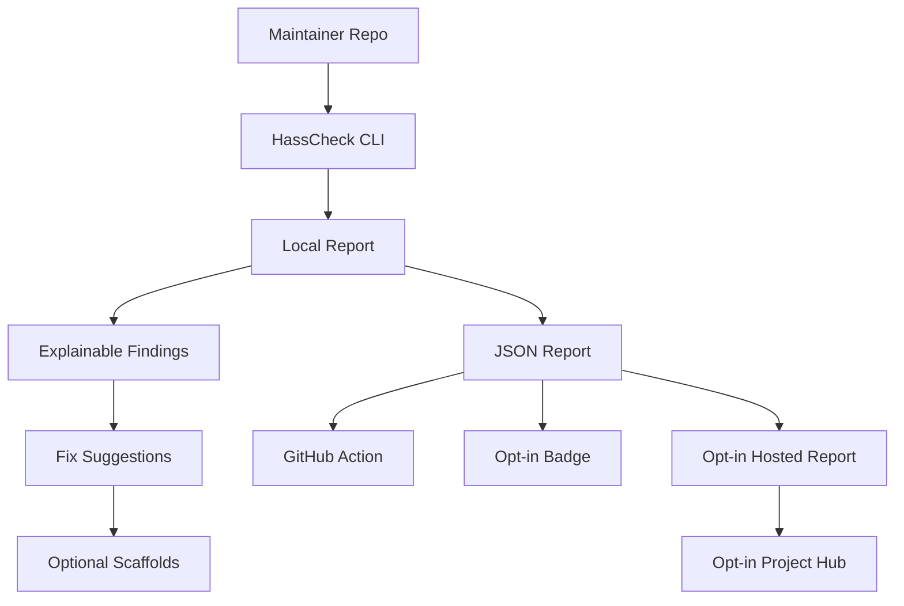
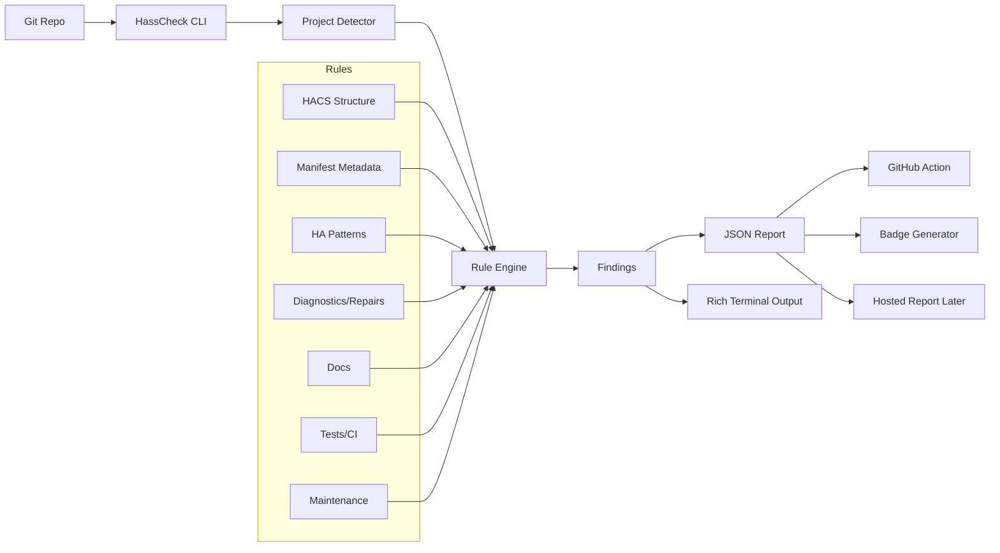

# HassCheck Product Brief

Updated: **2026-05-01**

Working name: **HassCheck**

> HassCheck turns scattered Home Assistant and HACS expectations into sourced,
> explainable, actionable checks for custom integration maintainers.

> ⚠️ **This document is the original product brief.** It captures the founding
> vision and is preserved as-is below. The Section 3 ladder and Section 15
> roadmap have been refreshed to reflect shipped reality through v0.12.0.
> For per-release detail see [`CHANGELOG.md`](./CHANGELOG.md). For
> architecture decisions and per-feature design see
> [`docs/`](./docs/README.md) and [`docs/decisions/`](./docs/decisions/).
>
> **Implementation status (2026-05-02):**
> - **Latest released**: `v0.12.0` — 52 rules, per-rule settings in
>   `hasscheck.yaml`, auto-generated per-rule docs, demo recording assets.
> - **In progress**: pre-v1.0 polish. See open GitHub issues #128–#132 for
>   the launch-blocker backlog plus #15 (PyPI publish), #67 (hub-verified
>   badges), #103 (prose-only doc heuristics).
> - **Hosted endpoint** (`hasscheck.io`): live and accepting opt-in published
>   reports via GitHub OIDC. Built in the private `hasscheck-web` repo per
>   ADR 0008.

## Executive correction

HassCheck should **not** start as a scoring, ranking, certification, or public
repo-grading product.

It should start as a local CLI that produces sourced, explainable, actionable
reports for maintainers.

The foundation is:

```text
local reports first
opt-in badges later
opt-in hosted reports later
opt-in hub only after projects explicitly publish reports
```

Do **not** crawl and grade random public repositories early. That creates drama
before the tool has earned trust.

---

# 1. Product position

## One-line pitch

> HassCheck is an unofficial CLI that checks Home Assistant custom integration
> repos against sourced HA/HACS quality signals and produces explainable,
> actionable reports.

The key phrase is **quality signals**, not certification.

## Product name

Keep: **HassCheck**

Why this works:

- “Hass” is familiar in the Home Assistant ecosystem.
- “Check” maps naturally to CLI validation, CI, badges, and reports.
- It does not pretend to be official.
- It can grow from local checks into opt-in published reports.

Avoid names that sound official, endorsed, or platform-owned:

```text
HA Forge
Home Assistant Forge
Open Home Forge
HACS Forge
```

There is naming risk around using “Home Assistant” directly as the lead brand.
Use an explicit unofficial disclaimer everywhere.

## Safe language

Use:

```text
HACS Checks: Passing
HACS Structure: Passing
HA Quality Signals
Maintenance Signals
Security Review: Not Performed
Official HA Tier: Not Assigned
HACS Acceptance: Not Guaranteed
```

Avoid:

```text
HACS Ready
Community Ready
Certified
Safe
Approved
Official
```

This wording is less sexy, but safer and more credible.

## README intro

```markdown
# HassCheck

HassCheck is an unofficial developer tool for Home Assistant community
integrations.

It checks custom integration repositories for HACS structure, Home Assistant
quality signals, documentation gaps, diagnostics support, repairs support,
tests, brand assets, and maintenance signals.

HassCheck does not certify integrations and is not affiliated with Home
Assistant, HACS, Nabu Casa, or the Open Home Foundation. It provides automated,
sourced checks and actionable recommendations to help maintainers build better
community projects.

Security Review: Not performed.
Official HA Tier: Not assigned.
HACS Acceptance: Not guaranteed.
```

---

# 2. Problem

Home Assistant has a huge community ecosystem, but custom integrations vary
wildly in quality.

Some are excellent. Some are abandoned. Some work but lack config flows,
diagnostics, tests, proper HACS structure, brand assets, release hygiene, or
docs. Users often cannot tell the difference until something breaks.

Home Assistant has an official Integration Quality Scale. HACS has publishing
expectations for custom integrations. The problem is that these expectations are
spread across docs, checklists, examples, and community knowledge.

Maintainers need a tool that answers:

> “What concrete improvements can I make to my custom integration today?”

Not:

> “What public grade does a third-party website assign to my repo?”

That distinction matters.

---

# 3. Product ladder

```text
v0.1    Local CLI                                                 [shipped]
v0.2    Stable JSON report schema + applicability + overrides     [shipped]
v0.3    Rule explanations + source links                          [shipped]
v0.4    Scaffolding / fix helpers                                 [shipped]
v0.5    GitHub Action + unified --format flag                     [shipped]
v0.6    Opt-in badges                                             [shipped]
v0.7    Opt-in hosted reports (OIDC publish)                      [shipped]
v0.8    Rule depth + publish polish + LICENSE/metadata            [shipped]
v0.9    AST helper extraction + README content rules + adoption   [shipped]
        docs (comparison + per-rule pages + demo walkthrough)
v0.10   Rule expansion: manifest.requirements, config_flow        [shipped]
        advanced (reauth/reconfigure/duplicate/connection),
        modern HA pattern checks (async_setup_entry, runtime_data,
        unique_id, has_entity_name, device_info)
v0.11   Test detection + maintenance signals + auto-generated     [shipped]
        per-rule docs + demo recording
v0.12   Per-rule settings in hasscheck.yaml + four more docs.*    [shipped]
        rules + diagnostics field cleanup
v0.13.x Pre-v1.0 polish: report.provenance schema field,          [in progress]
        hasscheck publish --dry-run, action.yml + README
        consistency, Upgrade Radar positioning + ADR 0010
v1.0    Opt-in project hub with verified Upgrade Radar — discovery [planned]
        from voluntarily published reports, OIDC-verified
        provenance display, hub-generated badges replacing
        self-reported committed JSON, status taxonomy
        (Fresh / Warnings / Failing / Stale / Unverified)
```

Each rung adds value the previous rung cannot deliver alone. The hub only
becomes useful after HassCheck produces structured, trusted, explainable
reports at meaningful volume. Otherwise it is just another directory.

---

# 4. Core workflow



Important: the public layers are opt-in. No unsolicited public grading.

---

# 5. Revised output model

Do not lead with one big score. A single score invites arguments. Category
signals invite fixes.

Preferred terminal summary:

```text
HassCheck Summary

HACS Structure:          8 / 10
Manifest Metadata:       7 / 10
Modern HA Patterns:     12 / 20
Diagnostics/Repairs:     4 / 10
Tests/CI:                3 / 10
Docs:                    6 / 10
Maintenance Signals:     5 / 10

Overall: Informational only
Security Review: Not performed
Official HA Tier: Not assigned
HACS Acceptance: Not guaranteed
```

Then show findings:

```text
Findings

✅ PASS  manifest.domain exists
✅ PASS  manifest.issue_tracker exists
⚠️ WARN  diagnostics.py missing
❌ FAIL  config_flow.py exists but manifest config_flow is not true
➖ N/A   reauth flow not required because auth_required=false
🔎 MANUAL repairs flow may be relevant; confirm user-fixable failures exist
```

Status vocabulary:

```text
pass
warn
fail
not_applicable
manual_review
```

---

# 6. Required v0.1 design decisions

## Decision 1: Rule applicability is mandatory

Every rule must support applicability. Without `not_applicable`, HassCheck will
unfairly punish small or simple integrations.

Example:

```yaml
rule_id: repairs.flow.exists
status: not_applicable
reason: Integration does not expose user-fixable repair scenarios.
```

Applicability can be detected, configured, or manually overridden.

Example config:

```yaml
# hasscheck.yaml
project:
  type: integration

applicability:
  auth_required: false
  has_devices: true
  cloud_service: false
  uses_config_entry: true

rules:
  repairs.flow.exists:
    status: not_applicable
    reason: No user-fixable repair scenario yet.
```

## Decision 2: Rules must be versioned

Home Assistant and HACS change. Rule versioning is not overengineering; it is
how HassCheck avoids stale authority.

Every finding should include:

```yaml
rule_id: hacs.manifest.required_fields
rule_version: 1.0.0
ruleset: hasscheck-ha-2026.4
source_url: https://www.hacs.xyz/docs/publish/integration/
source_checked_at: 2026-05-01
```

## Decision 3: JSON schema is a first-class product

JSON output is the contract for:

```text
CLI output
GitHub Action
badges
hosted reports
hub
historical trends
third-party tooling
```

v0.1 should include:

```bash
hasscheck check --path .
hasscheck check --path . --json
hasscheck schema
hasscheck explain RULE_ID
```

## Decision 4: No global certification language

HassCheck reports automated signals only.

Never claim:

```text
certified
safe
approved
official tier assigned
HACS acceptance guaranteed
```

## Decision 5: Every rule must be explainable

Every rule needs:

```text
rule_id
rule_version
category
severity/status
applicability
why it matters
how to fix
source_url
source_checked_at
examples, when useful
```

This is the difference between a helpful maintainer tool and annoying lint
noise.

---

# 7. v0.1 MVP

## Commands

```bash
hasscheck check --path .
hasscheck check --path . --json
hasscheck schema
hasscheck explain RULE_ID
```

## Initial checks

```text
HACS structure
manifest fields
hacs.json parse
README exists
LICENSE exists
brand/icon.png exists
config_flow.py exists
manifest config_flow consistency
diagnostics.py exists
repairs.py exists
tests folder exists
GitHub Actions exists
```

## Must-have internals

```text
stable JSON schema
rule IDs
rule versions
ruleset versions
source links
source_checked_at timestamps
not_applicable status
manual_review status
category signals
no global certification language
```

## Success metric

> A maintainer runs `hasscheck check` and finds 3 concrete improvements they can
> make today.

That is the real product bet.

---

# 8. JSON report shape

Draft schema shape:

```json
{
  "schema_version": "0.1.0",
  "tool": {
    "name": "hasscheck",
    "version": "0.1.0"
  },
  "project": {
    "path": ".",
    "type": "integration",
    "domain": "my_integration"
  },
  "ruleset": {
    "id": "hasscheck-ha-2026.4",
    "source_checked_at": "2026-05-01"
  },
  "summary": {
    "overall": "informational_only",
    "security_review": "not_performed",
    "official_ha_tier": "not_assigned",
    "hacs_acceptance": "not_guaranteed",
    "categories": [
      {
        "id": "hacs_structure",
        "label": "HACS Structure",
        "points_awarded": 8,
        "points_possible": 10
      }
    ]
  },
  "findings": [
    {
      "rule_id": "manifest.domain.exists",
      "rule_version": "1.0.0",
      "category": "manifest_metadata",
      "status": "pass",
      "severity": "required",
      "title": "manifest.json defines domain",
      "message": "The integration manifest defines a domain.",
      "applicability": {
        "status": "applicable",
        "reason": "All integrations need a manifest domain."
      },
      "source": {
        "url": "https://www.hacs.xyz/docs/publish/integration/",
        "checked_at": "2026-05-01"
      },
      "fix": null
    }
  ]
}
```

Keep this schema boring, explicit, and stable. Future products depend on it.

---

# 9. Rule categories

## A. HACS structure signals

Purpose: validate repository shape and HACS-oriented metadata.

Checks:

```text
custom_components/ exists
exactly one integration directory, unless explicitly configured
manifest.json exists
hacs.json exists and parses
README.md exists
LICENSE exists
brand/icon.png exists
GitHub releases present: optional/preferred, not required
```

Language:

```text
HACS Checks: Passing
HACS Structure: Passing
HACS Acceptance: Not guaranteed
```

Not:

```text
HACS Ready
```

## B. Manifest metadata signals

Checks:

```text
domain
name
version
documentation
issue_tracker
codeowners
config_flow consistency
requirements sanity
iot_class sanity
```

## C. Modern HA pattern signals

Checks:

```text
config_flow.py exists
manifest has config_flow: true when config_flow.py exists
user step exists
reauth flow exists when auth_required=true
reconfigure flow exists when relevant
duplicate entries are prevented
connection is tested before setup
async_setup_entry exists
async_unload_entry exists
ConfigEntry.runtime_data pattern is used
platforms are forwarded correctly
unique_id used where entities exist
has_entity_name = True where entities exist
device_info used where appropriate
entity categories used where appropriate
device classes used where possible
```

Many of these require applicability or manual review. Do not blindly fail every
integration.

## D. Diagnostics and repairs signals

Diagnostics checks:

```text
diagnostics.py exists
async_get_config_entry_diagnostics implemented
async_get_device_diagnostics implemented when devices exist
async_redact_data used or equivalent redaction exists
common secret names redacted
raw config entry data is not dumped unredacted
```

Repairs checks:

```text
repairs.py exists when user-fixable repair scenarios exist
repair issue identifiers are stable
issue severity is appropriate
translation strings exist
repair flow exists for fixable user problems
```

Repairs are especially applicability-sensitive. Absence should often be `warn`,
`manual_review`, or `not_applicable`, not always `fail`.

## E. Documentation signals

Checks:

```text
installation instructions
HACS instructions
manual install fallback
configuration instructions
removal instructions
troubleshooting
known limitations
supported devices/services
examples
privacy/data notes
```

## F. Tests and CI signals

Checks:

```text
tests/ exists
config flow tests exist
setup entry tests exist
unload tests exist
diagnostics tests exist when diagnostics exist
repairs tests exist when repairs exist
pytest config exists
GitHub Actions runs tests
```

## G. Maintenance signals

Checks:

```text
recent commits
recent release, when releases are used
issue tracker configured
license present
code owners present
release notes present
```

Maintenance signals should be informational. Do not imply abandonment solely from
age.

---

# 10. Scaffolding/fix helpers

Scaffolding starts only after the CLI findings are useful.

Commands:

```bash
hasscheck scaffold diagnostics
hasscheck scaffold repairs
hasscheck scaffold github-action
hasscheck scaffold issue-template
hasscheck scaffold release-workflow
```

Example finding:

```text
⚠️ diagnostics.py missing

Why it matters:
Diagnostics help users provide useful support data without exposing secrets.

Fix:
Run:
  hasscheck scaffold diagnostics

Status:
Recommended, not required for all integrations.
```

Generated files must be conservative and heavily commented. Bad generated code
will hurt trust faster than missing scaffolds.

---

# 11. GitHub Action

Goal: make HassCheck useful in PRs without forcing public scoring.

Deliverables:

```text
GitHub Action
PR summary comment
Markdown report
JSON artifact upload
config file support
```

Example workflow:

```yaml
name: HassCheck

on:
  pull_request:
  push:
    branches: [main]

jobs:
  hasscheck:
    runs-on: ubuntu-latest
    steps:
      - uses: actions/checkout@v4
      - uses: hasscheck/action@v1
```

Example PR comment:

```text
HassCheck Signals

Improved:
  ✅ diagnostics.py added
  ✅ manifest.issue_tracker present

Still useful to review:
  ⚠️ tests folder missing
  🔎 repairs flow may not apply; confirm user-fixable repair scenarios exist

Security Review: Not performed
Official HA Tier: Not assigned
HACS Acceptance: Not guaranteed
```

---

# 12. Badges

Badges are opt-in and should expose specific signals, not vague trust claims.

Good badges:

```text
HACS Checks: Passing
Diagnostics: Present
Config Flow: Present
Tests: Partial
HassCheck: Signals Available
```

Bad badges:

```text
Certified
Safe
Approved
HACS Ready
Community Ready
```

---

# 13. Hosted reports and hub

## Hosted reports

Hard rule:

```text
No public hosted report unless the maintainer publishes it.
```

A hosted report is a shareable rendering of a JSON report. It should show raw
findings, category signals, source links, and fix paths.

## Hub

The hub only includes voluntarily published reports.

It should start as a searchable report directory, not a ranking machine.

Filters:

```text
HACS checks passing
config flow present
diagnostics present
repairs present
tests present
recent release
active maintenance
```

Avoid default sorting by “best score” early. That recreates the public grading
problem.

---

# 14. Recommended architecture



Recommended stack:

| Layer | Recommendation | Reason |
| --- | --- | --- |
| CLI | Python + Typer | HA ecosystem is Python-heavy; clean CLI UX |
| Validation/models | Pydantic | Structured report models and schema generation |
| Output | Rich | Good terminal tables and status rendering |
| Static checks | pathlib, ast, json, yaml | Enough for v0.1 |
| Packaging | uv or hatch | Modern Python packaging |
| Tests | pytest | Standard Python testing |
| CI | GitHub Actions | Community repos live on GitHub |
| Hosted reports | Later: FastAPI + SQLite/Postgres | Do not build first |
| Docs | MkDocs Material | Good technical documentation UX |

Suggested repo layout:

```text
hasscheck/
├── pyproject.toml
├── README.md
├── LICENSE
├── src/
│   └── hasscheck/
│       ├── cli.py
│       ├── config.py
│       ├── detect.py
│       ├── models.py
│       ├── report.py
│       ├── schema.py
│       ├── explain.py
│       ├── rules/
│       │   ├── __init__.py
│       │   ├── hacs_structure.py
│       │   ├── manifest.py
│       │   ├── config_flow.py
│       │   ├── diagnostics.py
│       │   ├── repairs.py
│       │   ├── docs.py
│       │   ├── tests.py
│       │   ├── brands.py
│       │   └── maintenance.py
│       ├── scaffold/
│       │   ├── diagnostics.py
│       │   ├── repairs.py
│       │   └── github_action.py
│       └── templates/
├── tests/
├── docs/
└── examples/
    ├── good_integration/
    ├── bad_integration/
    └── partial_integration/
```

---

# 15. Roadmap

## Month 1 — CLI foundation

Goal:

> Give maintainers useful local feedback without public judgment.

Deliverables:

```text
Typer CLI
Rule engine
JSON schema
Rich terminal output
Rule explanation system
10–15 initial rules
Example good/bad integrations
```

Success metric:

> A maintainer runs `hasscheck check` and finds 3 concrete improvements they can
> make today.

## Month 2 — Better findings and fix paths

Goal:

> Move from “you failed” to “here is what to do next.”

Deliverables:

```text
Fix suggestions per rule
Rule source links
Applicability detection
Manifest/config_flow consistency checks
Diagnostics scaffold
Repairs scaffold
GitHub Actions scaffold
```

## Month 3 — GitHub Action

Goal:

> Make HassCheck useful in PRs without forcing public scoring.

Deliverables:

```text
GitHub Action
PR summary comment
Markdown report
JSON artifact upload
Config file support
```

## Month 4 — Opt-in badges

Goal:

> Let maintainers show specific checks, not vague certification.

Deliverables:

```text
Specific badge generator
Badge endpoint or static SVG output
Badge docs with forbidden language guidance
```

## Month 5 — Opt-in hosted reports (v0.7) [shipped]

Goal:

> Let projects publish reports voluntarily.

Shipped:

```text
hasscheck publish CLI (OIDC auth)
hasscheck init CLI (workflow scaffold)
emit-publish action input + composite handshake
repo slug detection (git remote → manifest fallback)
ADR 0008 — publish contract (two-repo split, schema lockstep, last-50 retention)
```

Server-side endpoint (`hasscheck.io`) lives in the private `hasscheck-web`
repo per ADR 0008. The OSS package remains fully usable without the server.

## Month 5.5 — Rule depth + release hygiene (v0.8 + v0.8.1) [shipped]

Goal:

> Make hosted reports substantive — local rules must produce real signal.

Shipped:

```text
7 new rules across manifest / config_flow / diagnostics
  manifest.domain.matches_directory (REQUIRED, non-overridable)
  manifest.iot_class.{exists,valid}
  manifest.integration_type.{exists,valid}
  config_flow.user_step.exists (first AST-based rule)
  diagnostics.redaction.used (AST + suspicious-return-pattern)
examples/bad_integration tracked negative fixture
publish polish: --force, --enable-publish, publish.endpoint config tier
LICENSE (MIT, Daily Nerd 2026) + pyproject PEP 639 metadata
ADR 0009 — schema versioning policy (additive-only, lockstep)
v0.8.1 patch: test_check_version collection + pylance manifest narrowing
```

## Month 6 — AST refactor + adoption docs (v0.9) [shipped]

Goal:

> Prepare for public flip. Make HassCheck legible and trustworthy on first
> contact.

Shipped:

```text
src/hasscheck/ast_utils.py — public parse_module shared by AST rules
5 README content rules: docs.{installation,configuration,
  troubleshooting,removal,privacy}.exists (rule count 25 → 30)
hassfest / HACS / HassCheck comparison section in README
docs/rules/ index covering all 30 rules + 7 hand-written per-rule pages
docs/demo.md walkthrough using examples/bad_integration
CONTRIBUTING.md + CODE_OF_CONDUCT.md (Contributor Covenant 2.1)
README "Current status" + emit-publish framing aligned with reality
```

## Month 7 — Rule expansion (v0.10) [shipped]

Goal:

> Make the rule surface deep enough that hosted reports carry signal.

Shipped:

```text
manifest.requirements sanity (#100) — is_list, entries_well_formed
  (PEP 508), no_git_or_url_specs
config_flow advanced (#101) — reauth_step, reconfigure_step,
  unique_id.set, connection_test heuristic
modern HA pattern checks (#107) — async_setup_entry,
  runtime_data, entity unique_id, has_entity_name, device_info
ast_utils.has_async_function helper extraction
```

## Month 7.5 — Test detection + maintenance + docs tooling (v0.11) [shipped]

Goal:

> Close the rule-docs scaling gap and add maintenance signals.

Shipped:

```text
test detection rules (#108) — config_flow / setup_entry / unload
maintenance signals (#109) — recent_commit, recent_release,
  changelog presence (local git only, no GitHub API)
auto-generated per-rule docs from RuleDefinition metadata (#104),
  CI drift check for stale pages
demo recording assets (#105) — docs/demo.sh + docs/recording.md +
  docs/demo.gif rendered via asciinema + agg
```

## Month 7.6 — Per-rule settings + more docs rules (v0.12) [shipped]

Goal:

> Make rules tunable without monkey-patching; close the docs.* tail.

Shipped:

```text
per-rule settings in hasscheck.yaml (#117) — RuleOverride.settings
  + ProjectContext.rule_settings + get_rule_setting helper; wires
  #109 maintenance thresholds
four more docs.*.exists rules (#102) — examples, supported_devices,
  limitations, hacs_instructions
diagnostics field cleanup (#106) — drop dead imports_async_redact;
  lock conservative "call required" PASS stance
```

## Month 8 — Pre-v1.0 polish (v0.13.x) [in progress]

Goal:

> Close the v1.0 review punch list. Make the launch surface coherent.

Sequenced deliverables:

```text
fix(action) — badge step .venv/bin/python bug (#128) [shipped]
docs(readme) — sync Current status to v0.12.0 reality (#129)
feat(schema) — optional report.provenance block, schema 0.3.0 → 0.4.0 (#130)
feat(cli) — hasscheck publish --dry-run (#131)
docs — Upgrade Radar v1.0 positioning + ADR 0010 status taxonomy (#132)
PyPI trusted publishing (#15) — depends on repo public flip
```

## Month 9+ — Opt-in hub with verified Upgrade Radar (v1.0) [planned]

Goal:

> Discovery from voluntarily published reports. Verified by GitHub OIDC.
> No public scoring.

The v1.0 narrative is **HassCheck Upgrade Radar — verified upgrade-readiness
signals for Home Assistant custom integrations.** The hub answers the user
question: *"Can I trust this integration enough before I install or upgrade?"*

Deliverables:

```text
Upgrade Radar status taxonomy — Fresh / Warnings / Failing / Stale /
  Unverified, computed server-side from latest verified report
OIDC verified provenance display on every report page (commit SHA,
  ref, run id, ruleset, tool version)
hub-verified badges — server-generated from latest verified report,
  replacing self-reported committed badge JSON (#67)
project profiles + report directory (read-only)
search, sorted by published_at DESC, no score ranking
schema bump policy enforced via ADR 0009 (lockstep with hasscheck-web)
```

The hub becomes useful only after enough voluntary publish events from
real maintainers. Distribution (PyPI #15 + repo public flip) gates this —
v1.0 cannot start without community signal.

---

# 16. First GitHub issues

Initial backlog:

```text
1. Create Python CLI skeleton with Typer
2. Define v0.1 JSON report schema
3. Add rule model with pass/warn/fail/not_applicable/manual_review statuses
4. Add ruleset and rule version metadata
5. Add project discovery for custom_components/*
6. Parse and validate manifest.json
7. Parse and validate hacs.json
8. Add HACS structure checks
9. Add manifest/config_flow consistency check
10. Add Rich terminal report output
11. Add JSON report output
12. Add hasscheck schema command
13. Add hasscheck explain RULE_ID command
14. Add README/docs existence checks
15. Add brand/icon.png check
16. Add diagnostics.py presence check
17. Add repairs.py presence check with applicability support
18. Add tests folder and GitHub Actions checks
19. Add example good/bad/partial integrations
20. Add initial docs and unofficial disclaimer
```

---

# 17. Rule format

Every rule should be structured like this:

```yaml
id: diagnostics.redaction
version: 1.0.0
ruleset: hasscheck-ha-2026.4
category: diagnostics_repairs
severity: warning
status_values:
  - pass
  - warn
  - fail
  - not_applicable
  - manual_review
title: Diagnostics should redact sensitive data
why: Diagnostics can expose secrets if raw config data is returned.
check: diagnostics.py uses async_redact_data or equivalent redaction.
fix: Use async_redact_data with a TO_REDACT list.
source_url: https://developers.home-assistant.io/docs/core/integration/diagnostics/
source_checked_at: 2026-05-01
```

Example terminal explanation:

```text
⚠️ diagnostics.redaction

Diagnostics can expose secrets if raw config data is returned.

Fix:
Use async_redact_data with a TO_REDACT list containing API keys, tokens,
passwords, precise location, and user identifiers.

Docs:
Home Assistant Developer Docs → Integration diagnostics

Security Review: Not performed
```

---

# 18. Risk register

| Risk | Severity | Decision |
| --- | ---: | --- |
| Public repo grading backlash | High | Opt-in only until trust is earned |
| Unfair scoring | High | Category signals + applicability + `not_applicable` |
| Rule staleness | High | Versioned rules + source timestamps |
| False authority | High | No “certified/safe/approved” language |
| HACS edge cases | Medium/High | Say “HACS Checks,” not “HACS Ready” |
| Scope creep | High | v1 integrations only |
| JSON schema refactor pain | High | Stable schema in v0.1 |
| Maintainer annoyance | Medium | Findings must include fix paths |
| Generated code quality | Medium | Conservative scaffolds with comments |
| Trademark/brand confusion | Medium | HassCheck name + explicit unofficial disclaimer |
| Security liability | Medium | Always state security review was not performed |

---

# 19. What not to check in v1

Do not attempt these first:

```text
full semantic correctness of every integration
runtime testing against physical devices
security certification
official HA quality tier assignment
safe-to-install claims
deep static analysis of every API call
automatic PRs to random repos
HACS replacement
public crawling/ranking of random repositories
```

Be careful with language. HassCheck should say:

> Automated checks passed.

Not:

> Certified safe.

---

# 20. Source-of-truth policy

Rules must link back to official docs whenever possible.

Primary sources:

- Home Assistant Developer Docs — Integration Quality Scale
- Home Assistant Developer Docs — Integration Quality Scale Rules
- Home Assistant Developer Docs — Integration diagnostics, repairs, config flows,
  brands, config entries, and entities
- HACS publishing docs for integrations

If official docs are ambiguous, the rule should become `manual_review` or
`warn`, not a hard `fail`.

Every rule should carry a `source_checked_at` date so stale assumptions are
visible.

---

# 21. Final build order

```text
1. CLI checker
2. Stable JSON schema
3. Explainable rules
4. Applicability / not_applicable
5. Fix suggestions
6. Scaffolding
7. GitHub Action
8. Opt-in badges
9. Opt-in hosted reports
10. Opt-in hub
```

Final verdict:

> Build the CLI that gives brutally clear, sourced, actionable feedback. The
> public platform only earns the right to exist after maintainers trust the local
> tool.
